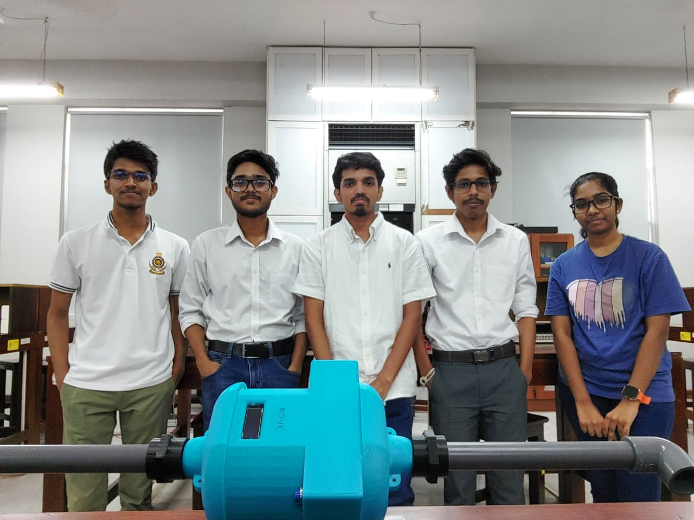

# 💧 Automated IoT Smart Water Meter

**Project for EN2160 - Electronic Design Realization** *Department of Electronic and Telecommunication Engineering, University of Moratuwa*

An ultra-low-power, end-to-end IoT smart water metering system designed to tackle Sri Lanka’s Non-Revenue Water (NRW) challenges. By replacing conventional manual metering, this system enables real-time water consumption monitoring, automated billing, and early leak detection.

  
  

## 💡 System Overview

The system integrates embedded hardware, GSM communication, and cloud-based data management to create a scalable IoT platform. 

A Hall-effect sensor detects electrical pulses generated by a rotor-mounted permanent magnet as water flows. An STM32L0 microcontroller processes these pulses to calculate the instantaneous flow rate and cumulative water volume. The data is then transmitted via a SIM800L GSM module using HTTP POST requests to a centralized Supabase cloud database.

## 🚀 Key Features

* **Ultra-Low Power Architecture:** Powered by a 19,000 mAh Li-SOCl2 primary battery. By utilizing the STM32L0's sleep states and duty-cycling the GSM module, the system is designed for a 10+ year operational lifespan.
* **Real-Time GSM Telemetry:** Standalone operation using quad-band GSM/GPRS; does not rely on local Wi-Fi infrastructure.
* **Automated NRW Detection:** Continuous flow monitoring identifies abnormal consumption patterns and potential leaks.
* **Dual Web Dashboards:**
  * **WaterboardOS:** A centralized administrative portal for utilities to monitor system-wide analytics, revenue, and active clients.
  * **AquaSync:** A consumer-facing web application for live bill estimation, historical usage tracking, and leak notifications.

## ⚙️ Hardware Specifications

The custom 2-layer FR-4 PCB was designed using Altium Designer.

* **Microcontroller:** STM32L071CBT6 (32-bit ARM Cortex-M0+ @ 32 MHz).
* **Communication:** SIM800L GSM/GPRS Module (Power toggled via AO3401A P-channel MOSFET).
* **Power Subsystem:** 3.6V Li-SOCl2 Battery regulating to a 3.3V LDO (XC6206) for the MCU and a 4V Buck-Boost Converter (TPS61023DRLR) for the GSM module.
* **Sensors & Peripherals:** Hall-effect flow sensor inputs (TIM2), I2C OLED display header, and expansion GPIOs (PA3, PA4, PB13–PB15).

## 👥 Team Excalibur
* **W.M.H. Wanigasundara** 
* **A.H.T.M. Weerakoon**
* **H.W.D. Prabarshana** 
* **K.D. Manatunga**
* **H.D.J.D. Samaranayaka** 

---
*Developed for the EN2160 Electronic Design Realization module, University of Moratuwa (2026).*
